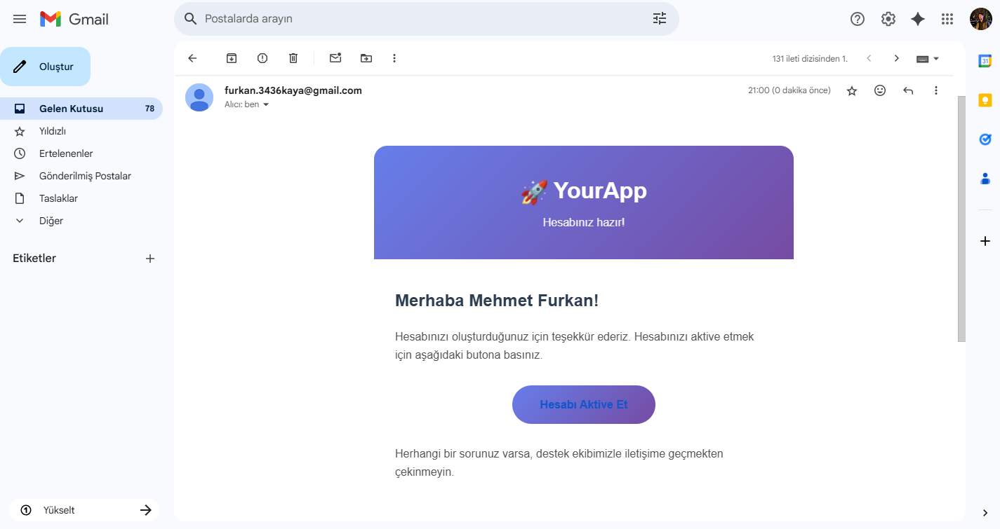

# ✉️ Mail Verification

<div align="center">
  <h3>⚡ Architecture Schema </h3>
  
</div>

<br>

<details>
<summary> 👤 Create Account </summary>

</details>

<br>

<details>
<summary> ✅ Verify Account </summary>


</details>

<br>

<details>
<summary> 📧 Email Notification </summary>

</details>

<br>

<details>
<summary> ❌ Unverified </summary>

</details>

<br>

<details>
<summary> ⚠️ Invalid OTP </summary>

</details>

<br>

<details>
<summary> 🔄 Re-verify </summary>

</details>

<br>

<details>
<summary>🐳 Docker </summary>

</details>

<br>

<details>
<summary> 📚 Swagger UI </summary>

</details>

<br>

## 📖 About

- ✅  This project demonstrates a secure user registration system with email-based OTP (One-Time Password) verification. Users can create accounts and verify their email addresses through a time-limited verification code sent via email.

<br>

## 🛠️ Technologies Used

[](https://www.oracle.com/java/)
[](https://spring.io/projects/spring-boot)
[](https://www.mysql.com/)
[](https://www.postgresql.org/)
[](https://www.adminer.org)
[](https://gradle.org/)
[](https://www.docker.com/)
[](https://www.docker.com/)

<br>

### 🚀 Quick Start
#### Prerequisites
- Java 17+
- MySQL 8.0
- PostgreSQL 15.2
- Docker & Docker Compose

#### Database Configuration

- **MySQL**
- **URL:** `http://localhost:9090` (Adminer)
- **Database:** `email_db`
- **Username:** `mysql`
- **Password:** `mysql`

<br>

- **PostgreSQL**
- **URL:** `http://localhost:9090` (Adminer)
- **Database:** `email_db`
- **Username:** `postgres`
- **Password:** `postgres`

### Installation

```shell
git clone https://github.com/furkankayam/spring-boot-email-verification.git
cd spring-boot-email-verification
```

<br>

### Usage

```shell
docker-compose up
```

```shell
./gradlew build
```

```shell
./gradlew :mail-service:bootRun
./gradlew :account-service:bootRun
```

#### 3. Access endpoints

- Database UI: `http://localhost:9090`
- Mail Service `http://localhost:8082/swagger-ui/index.html`
- Account Service: `http://localhost:8081/swagger-ui/index.html`

<br>

# License

This project is licensed under the MIT License. See the [LICENSE](LICENSE) file for details

**Created by** [Mehmet Furkan KAYA](https://www.linkedin.com/in/mehmet-furkan-kaya/)
